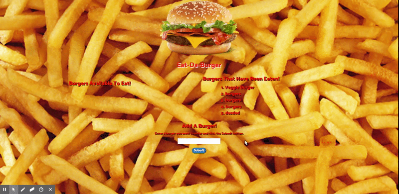

# Burger

* Eat-Da-Burger! is a restaurant app that lets users input the names of burgers they'd like to eat.

* Whenever a user submits a burger's name, your app will display the burger on the left side of the page -- waiting to be devoured.

* Each burger in the waiting area also has a Devour it! button. When the user clicks it, the burger will move to the right side of the page.

* Your app will store every burger in a database, whether devoured or not.
## A View From The App

 

## How to Use the App

* Install the application dependencies by typing
"***npm install***"

* After that make sure to create database using MySQL and run. You can just copy and paste from __schema.sql__ under __db__ folder. (__seed.sql__ is optional.) 

* Make sure you enter your own connection information to connect to your MySQL database. In this repo, my connection information is under "__.env__" file to keep my information anonymous. Once you clone the repo you should provide yours in this file. 

* Run the Node server locally "__node server.js__".

* Type "__localhost:8080__" in your browser to see the application.

## Technologies Used

* JavaScript
* Node.js
* Express.js and other Node packages (See "__package.json__" file).
* MySQL Workbanch
* Handlebars
* CSS 
* Bootstrap
